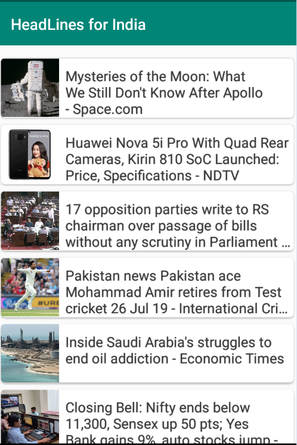
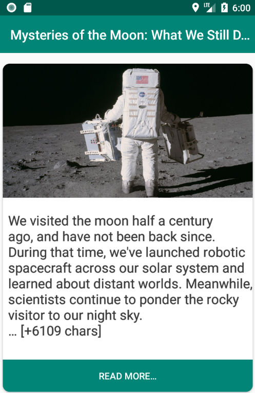

# MVVM_NewsApp_NesAPi
Highlights of this project----------------------------------------------------------------------------

1. MVVM
2. Retofit
3. Gson
4. RxJava
5. Picasso
6. AndroidX
7. Card view
8. Web view 

Application Architecture and features-----------------------------------------------------------------------------------------------------

This application architecture follows the MVVM architecture , which provides reactive , lifecycle aware and smooth implementation flow.

For achieveing this RxJava2 along with Retrofit are used.

Application basically fetches latest news from NewsAPI and provides options to view Trending news or view news by country.

Application opens detail page on click of any news and provides web link to read more (Web view).

# Screenshots: ----------------------------------------------

# 1. HomeScreen

# 2. Coutrywise headlines 

# 3. NewsDetail View

